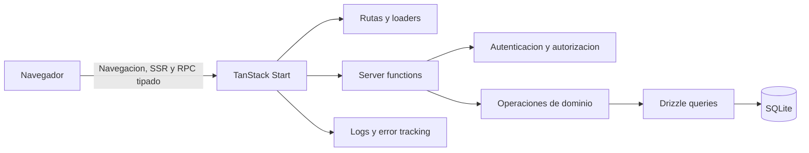
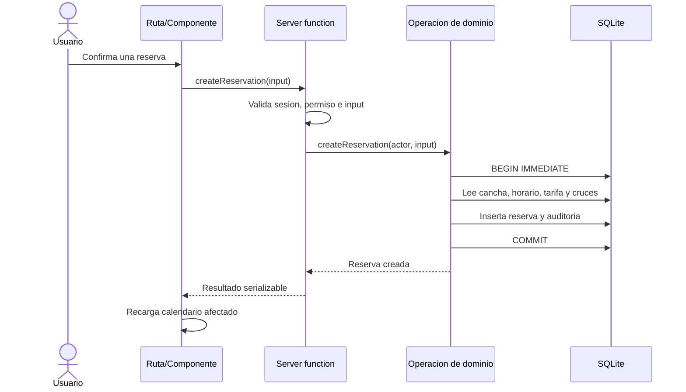
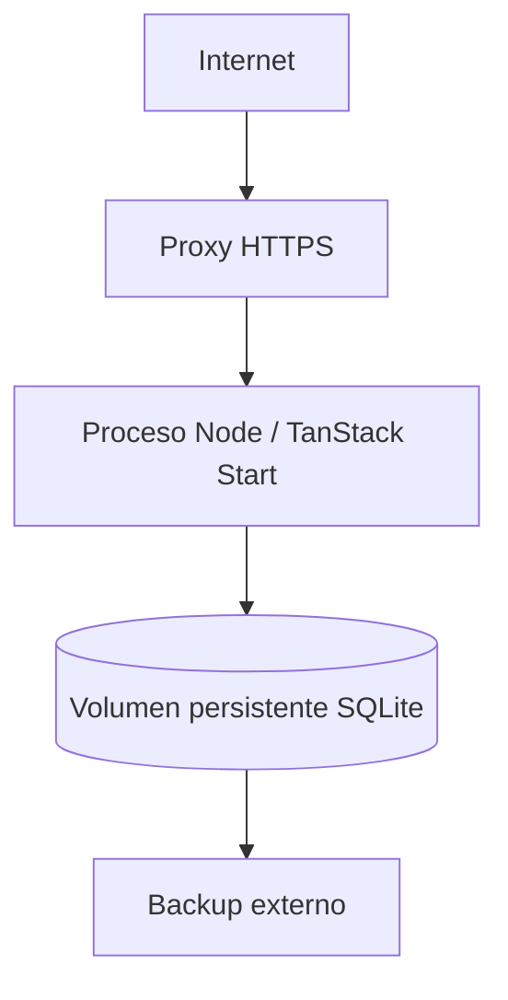

# Arquitectura

## 1. Proposito

Esta aplicacion administra el alquiler por horas de canchas de futbol. La experiencia se parece a un alojamiento por franjas horarias: buscar disponibilidad, cotizar, reservar y cobrar; ademas incluye la operacion interna de clientes, quiosco, inventario, caja y auditoria descrita en `docs/plan.md`.

La primera version es una aplicacion web para una sola sede. No es todavia un marketplace multi-sede con cuentas publicas para propietarios y jugadores. La arquitectura debe permitir entregar esa primera version sin introducir desde ahora las abstracciones de un marketplace hipotetico.

Este documento reemplaza las decisiones tecnicas incompatibles de `docs/plan.md`: se usara una sola aplicacion TanStack Start, server functions en lugar de una API REST y Drizzle ORM con SQLite en lugar de PostgreSQL.

## 2. Objetivos arquitectonicos

- Mantener una sola aplicacion TypeScript desplegable como una unidad.
- Usar las server functions de TanStack Start como RPC tipado entre navegador y servidor.
- Mantener las reglas de negocio y el acceso a datos exclusivamente en el servidor.
- Separar las funcionalidades por dominio sin implementar una arquitectura limpia completa.
- Proteger las invariantes de reservas, cobros, stock y caja dentro de transacciones SQLite.
- Hacer que las operaciones mutables sean seguras ante doble clic, reintentos y concurrencia razonable.
- Facilitar pruebas de reglas y operaciones sin duplicar contratos HTTP.
- Mantener una ruta clara para migrar la base de datos si el volumen o el despliegue superan a SQLite.

## 3. Principios

### Monolito modular

Frontend, renderizado del servidor, autenticacion, reglas de negocio y persistencia viven en el mismo proyecto y proceso. Los modulos se separan por funcionalidad, no por infraestructura horizontal.

Esta separacion es suficiente:

1. Las rutas componen pantallas y cargan datos.
2. Las server functions forman el limite de confianza.
3. Las operaciones de dominio aplican reglas y transacciones.
4. Drizzle accede a SQLite.

No se agregaran controladores HTTP, DTOs REST, clientes HTTP internos, repositorios genericos, casos de uso de una sola linea, interfaces con una unica implementacion ni un contenedor de inyeccion de dependencias.

### Servidor como autoridad

El navegador puede previsualizar disponibilidad, precios y permisos para mejorar la experiencia, pero nunca es autoridad. Toda mutacion vuelve a comprobar identidad, permisos, payload, estado actual, precio y disponibilidad en el servidor.

### Invariantes cerca de los datos

Los `UNIQUE`, `CHECK`, claves foraneas e indices viven en SQLite. Las invariantes que SQLite no puede expresar de forma declarativa, como el solapamiento de rangos, se comprueban dentro de una transaccion que obtiene el bloqueo de escritura antes de leer.

### Pocas capas, limites firmes

Una server function sencilla puede validar, autorizar y ejecutar una consulta directamente. Cuando una operacion contiene reglas, varias escrituras o necesita una prueba aislada, se extrae a una funcion de dominio dentro del mismo modulo. No se crea una capa solo para reenviar argumentos.

## 4. Vista general



TanStack Start genera el transporte de las server functions. Que una llamada parezca una funcion local no elimina la frontera de red: sus entradas siguen siendo datos no confiables, puede fallar, puede repetirse y puede llegar en paralelo con otra llamada.

## 5. Contextos funcionales

Los modulos iniciales son:

| Modulo | Responsabilidad |
| --- | --- |
| `auth` | Sesiones, login, logout, usuarios, roles y permisos |
| `courts` | Canchas, estado operativo y horarios |
| `customers` | Datos de clientes sin cuenta de acceso |
| `rates` | Reglas tarifarias y cotizaciones |
| `reservations` | Disponibilidad, reservas y ciclo de vida |
| `payments` | Cobros, anulaciones y devoluciones |
| `catalog` | Categorias y productos |
| `sales` | Venta de quiosco y sus lineas |
| `inventory` | Stock y movimientos auditables |
| `cash` | Apertura, movimientos, cierre y conciliacion |
| `reports` | Lecturas agregadas de operacion e ingresos |
| `audit` | Registro de acciones sensibles |

Estos son limites de organizacion, no microservicios. Una operacion que cruza modulos, por ejemplo registrar una venta y descontar stock, tiene un unico propietario (`sales`) y ejecuta todas sus escrituras en una transaccion. No se coordina mediante eventos internos ni llamadas RPC entre modulos.

## 6. Organizacion del codigo

La estructura objetivo es orientativa; se crean directorios solo cuando una funcionalidad los necesita.

```text
src/
  routes/                         # Rutas TanStack, layouts y pantallas
    _public/
    _app/                         # Rutas autenticadas
  features/
    reservations/
      components/                 # UI exclusiva de reservas
      reservations.schema.ts      # Esquemas de entrada y tipos compartibles
      reservations.server.ts      # Server functions y operaciones server-only
      reservations.test.ts
    sales/
    inventory/
    cash/
  components/
    ui/                            # Primitivas visuales compartidas
  lib/
    auth.server.ts                 # Sesion y guards comunes
    db.server.ts                   # Conexion Drizzle/SQLite
    errors.ts                      # Errores serializables de aplicacion
    money.ts                       # Operaciones/formato de centimos
    time.ts                        # Instantes, zona operativa y business date
  db/
    schema.ts                      # Tablas, relaciones, checks e indices
    migrations/                    # Migraciones generadas y versionadas
```

Reglas de dependencias:

- Los archivos `.server.ts` y `db/` nunca se importan en componentes cliente.
- Las rutas pueden importar componentes, esquemas compartidos y server functions.
- Las server functions pueden importar autenticacion, operaciones de dominio y base de datos.
- Un modulo puede llamar una operacion de otro modulo en el servidor, pero no su server function.
- `components/ui` no conoce reglas de negocio.
- `lib` contiene solo utilidades realmente transversales; una utilidad usada por un unico modulo se queda en ese modulo.
- No se crea un archivo por cada funcion. Se divide un archivo cuando su responsabilidad o tamano lo justifica.

## 7. Rutas, carga y estado

### Rutas y loaders

TanStack Router maneja rutas basadas en archivos. Los loaders se usan para datos necesarios antes de renderizar una pantalla, como la sesion, las canchas del calendario o el detalle de una reserva. El loader llama una server function; no accede a Drizzle directamente.

Las rutas protegidas validan sesion antes de renderizar. Esto mejora navegacion y SSR, pero no sustituye la autorizacion de cada server function.

### Server functions

Las server functions son el contrato de aplicacion. Se agrupan por funcionalidad y se nombran por intencion, por ejemplo:

- `listAvailability`
- `quoteReservation`
- `createReservation`
- `cancelReservation`
- `recordReservationPayment`
- `createSale`
- `closeCashRegister`

Cada server function debe:

1. Declarar si es lectura o mutacion.
2. Validar y normalizar toda entrada con un esquema.
3. Obtener la sesion en el servidor.
4. Comprobar el permiso requerido.
5. Ejecutar la consulta u operacion de dominio.
6. Devolver solo datos serializables y necesarios para la UI.
7. Traducir fallos esperados a errores de aplicacion estables.

El tipo inferido por TypeScript mejora productividad, pero no reemplaza la validacion en runtime. Los esquemas de entrada pueden compartirse con formularios para feedback inmediato; las comprobaciones dependientes de datos siempre se repiten en el servidor.

No se expondra una API REST paralela para la aplicacion web. Solo se agregara una ruta HTTP explicita cuando exista un consumidor que no pueda usar las server functions, como un webhook de pagos o un health check de infraestructura.

### Estado cliente

- El estado de la URL contiene fecha seleccionada, filtros, busqueda y pagina cuando deba ser compartible o recuperable.
- Los loaders contienen el estado remoto principal de cada ruta.
- El estado React local contiene modales, campos de formulario y selecciones temporales.
- El carrito del quiosco puede vivir en estado cliente mientras no se confirme; el servidor vuelve a leer precios y stock al vender.
- No se agrega un store global por defecto.
- Tras una mutacion se invalida o recarga el dato minimo afectado.

TanStack Query solo se incorpora si aparecen necesidades reales de cache cliente, polling o actualizaciones optimistas que los loaders no resuelvan con claridad.

## 8. Flujo de una mutacion



La UI deshabilita temporalmente el envio para evitar dobles clics accidentales. La proteccion real es una clave de idempotencia y una restriccion unica en base de datos para operaciones financieras o no repetibles.

## 9. Persistencia con Drizzle y SQLite

### Conexion

`db.server.ts` crea y exporta una unica instancia de Drizzle por proceso. El driver concreto se elige segun el entorno de despliegue, pero debe soportar transacciones, claves foraneas y la forma de bloqueo requerida por las operaciones criticas.

Configuracion minima de SQLite:

- Activar `PRAGMA foreign_keys = ON` en cada conexion.
- Usar `journal_mode = WAL` para permitir lectores mientras existe un escritor.
- Configurar `busy_timeout` para absorber contencion breve en lugar de fallar inmediatamente con `SQLITE_BUSY`.
- No compartir el archivo SQLite mediante NFS o un filesystem de red no compatible.
- Mantener el archivo y sus archivos WAL en almacenamiento persistente local.

Los valores exactos de timeout y checkpoint se miden en produccion; no se convierten en configuracion de negocio.

### Representacion de datos

SQLite no tiene `timestamptz`, `numeric` ni enums nativos. Se usaran representaciones explicitas:

| Concepto | SQLite | Regla |
| --- | --- | --- |
| Identificador | `text` | UUID generado por la aplicacion |
| Instante | `integer` | Epoch milliseconds UTC |
| Fecha de negocio | `text` | `YYYY-MM-DD` en `America/Lima` |
| Hora local recurrente | `integer` | Minutos desde medianoche |
| Dinero | `integer` | Centimos de PEN; nunca `float` |
| Booleano | `integer` | `0` o `1` con `CHECK` |
| Estado | `text` | Union TypeScript y `CHECK` en tabla |
| JSON de auditoria | `text` | JSON serializado, sin secretos |

Los intervalos de reserva son semiabiertos: `[startsAt, endsAt)`. Por ello una reserva puede empezar exactamente cuando termina otra. `startsAt < endsAt`, duracion minima y alineacion a bloques se validan en servidor y, cuando sea practico, tambien mediante `CHECK`.

Todos los calculos de dinero usan enteros. La base, descuento, total y precios de linea se guardan como snapshots; editar una tarifa o producto nunca reescribe historia financiera.

### Esquema e indices

El esquema sigue el modelo de `docs/plan.md`, adaptado a tipos SQLite. Como minimo incluye `users`, `sessions`, `courts`, `customers`, `court_hours`, `rate_rules`, `reservations`, `payments`, `categories`, `products`, `stock_movements`, `sales`, `sale_items`, `cash_registers`, `cash_movements`, `audit_logs` e `idempotency_keys`.

Restricciones importantes:

- Email normalizado unico.
- Una clave de idempotencia unica por alcance y actor.
- Un pago referencia exactamente una reserva o una venta.
- Montos no negativos y cantidades validas.
- Una sola caja abierta por sede en la primera version.
- Claves foraneas sin cascadas destructivas sobre historial.
- Indices por cancha y rango de reserva, estados y fecha, pagos, ventas y movimientos de stock.

No se almacenan totales derivados salvo que sean snapshots financieros o exista una razon de rendimiento medida. El stock puede mantener `currentStock` para lectura rapida, pero cada cambio debe crear un movimiento y actualizar ambos valores en la misma transaccion.

### Migraciones

Drizzle Kit genera migraciones SQL versionadas. Las migraciones se revisan antes de integrarse y se ejecutan una sola vez durante despliegue, antes de aceptar trafico de la nueva version.

Reglas:

- Nunca usar sincronizacion destructiva del esquema en produccion.
- Probar migraciones desde una base vacia y desde una copia representativa.
- Crear backup antes de migraciones destructivas o reconstrucciones de tabla.
- No ejecutar migraciones concurrentemente desde varias replicas.
- Cuando SQLite requiera recrear una tabla, copiar y verificar los datos dentro de una migracion controlada.

## 10. Concurrencia e invariantes

SQLite admite multiples lectores pero un solo escritor. Esto encaja con una sede y un volumen moderado, siempre que el despliegue tenga un solo archivo autoritativo y las transacciones sean breves.

### Evitar doble reserva

SQLite no ofrece la exclusion constraint de PostgreSQL. La creacion o reprogramacion de una reserva debe:

1. Iniciar una transaccion de escritura inmediata (`BEGIN IMMEDIATE` o el equivalente garantizado por el driver).
2. Validar cancha, estado y horario dentro de la transaccion.
3. Buscar una reserva bloqueante de la misma cancha donde `existing.startsAt < requested.endsAt` y `existing.endsAt > requested.startsAt`.
4. Rechazar con `RESERVATION_CONFLICT` si existe.
5. Insertar reserva, snapshot de precio y auditoria.
6. Confirmar inmediatamente.

Obtener el bloqueo antes del `SELECT` evita que dos escritores lean simultaneamente “sin conflicto” y luego inserten ambos. Un `SELECT` fuera de esa transaccion es solo informativo para la UI.

### Cobros e idempotencia

Crear reserva, registrar pago, crear venta, anular y cerrar caja reciben una clave de idempotencia generada por el cliente. Dentro de la misma transaccion se registra alcance, actor, clave, estado y `resultId`. Si la clave ya termino, se devuelve la operacion original; si fue reutilizada con otro payload, se rechaza.

Las restricciones unicas siguen siendo la ultima defensa. No se depende de memoria del proceso para idempotencia.

### Inventario

La venta obtiene el bloqueo de escritura, vuelve a leer todos los productos, valida que siguen activos y que hay stock, guarda snapshots, crea venta y pago, descuenta stock, crea movimientos y registra caja/auditoria en una sola transaccion. No se permite una venta parcial si falla una linea.

### Transacciones

- Ninguna transaccion espera red, correo u otro servicio externo.
- Las lecturas necesarias para decidir una escritura ocurren dentro de la transaccion.
- Auditoria y movimientos derivados se confirman o revierten junto con la operacion.
- Los errores `SQLITE_BUSY` agotado pueden reintentarse pocas veces con espera acotada solo si la operacion es idempotente.

## 11. Tiempo y zona horaria

La zona operativa inicial es `America/Lima`.

- Los instantes se convierten a epoch milliseconds UTC antes de persistirse.
- La UI presenta fechas en la zona operativa.
- La fecha de caja se calcula en servidor a partir de `America/Lima`, no cortando un ISO UTC.
- Los horarios semanales se guardan como dia de semana y minutos desde medianoche.
- La primera version rechaza reservas que crucen medianoche; soportarlas despues requiere dividir validacion y tarifa por fecha local.
- La aplicacion no usa la zona horaria del servidor ni del navegador como valor implicito de negocio.

La conversion temporal se centraliza en `lib/time.ts`. Las reglas tarifarias operan sobre segmentos locales de 30 minutos; los instantes persistidos siguen siendo UTC.

## 12. Autenticacion y autorizacion

La sesion usa una cookie `httpOnly`, `secure` en produccion y `sameSite=lax`. El servidor almacena solo un hash del token de sesion, su usuario y expiracion. El logout revoca la sesion en base de datos.

Las contrasenas se almacenan con un algoritmo de hash adecuado para contrasenas. Nunca se registran contrasenas, tokens completos ni cookies.

Los roles iniciales son `admin`, `operator` y `viewer`. Los permisos se expresan como constantes en codigo y un guard comun `requirePermission`. No se necesita un motor dinamico de politicas para tres roles fijos.

Cada server function protegida comprueba:

1. Sesion valida y no expirada.
2. Usuario activo.
3. Permiso de la accion.
4. Pertenencia a la sede cuando ese concepto se introduzca.

Ocultar botones sin permiso es solo una ayuda visual. El control real siempre ocurre en el servidor.

## 13. Validacion y errores

Las entradas se validan en el limite de cada server function. Los errores esperados usan codigos estables, por ejemplo:

- `UNAUTHENTICATED`
- `FORBIDDEN`
- `VALIDATION_ERROR`
- `NOT_FOUND`
- `RESERVATION_CONFLICT`
- `RATE_NOT_FOUND`
- `INSUFFICIENT_STOCK`
- `REGISTER_ALREADY_CLOSED`
- `IDEMPOTENCY_CONFLICT`

El cliente decide el mensaje y la accion de UI a partir del codigo, no analizando texto. El error serializado contiene codigo, mensaje seguro, detalles de validacion cuando corresponda y `requestId`. No expone SQL, stack traces ni datos sensibles.

Los errores inesperados se registran en servidor con contexto y se devuelven como un error generico. Cada invocacion recibe un `requestId` propagado a logs y auditoria.

## 14. Auditoria

Se auditan acciones que cambian dinero, stock, reservas, usuarios, permisos o configuracion operativa. El registro incluye actor, accion, entidad, identificador, valores anterior/nuevo necesarios, motivo, instante y `requestId`.

La auditoria se escribe en la misma transaccion que el cambio. No reemplaza los logs tecnicos y no almacena secretos. Los registros financieros y de stock no se borran: anulaciones y devoluciones se representan mediante estado y movimientos compensatorios.

## 15. Lecturas y reportes

El calendario consulta un rango acotado e indices por cancha/fecha; nunca descarga toda la historia. Las server functions devuelven modelos de lectura adaptados a cada pantalla en lugar de filas completas de todas las tablas.

Los reportes se calculan a partir de ventas, pagos y movimientos validos, distinguiendo anulaciones y devoluciones. Para el volumen inicial se usan consultas SQL explicitas mediante Drizzle. No se introducen tablas agregadas ni un pipeline analitico hasta que una medicion lo justifique.

Las exportaciones grandes, si aparecen, se generan en servidor y se transmiten como archivo; no se cargan miles de filas en estado React.

## 16. Pruebas

La estrategia prioriza invariantes sobre cobertura porcentual.

### Unitarias

- Segmentacion y seleccion de tarifas.
- Validacion de rangos y bloques.
- Transiciones de estados.
- Dinero, descuentos y totales.
- Conversion entre instante, hora local y fecha de negocio.

### Integracion con SQLite real

- Migraciones desde una base vacia.
- Permisos de server functions.
- Creacion, reprogramacion y cancelacion de reservas.
- Dos intentos concurrentes sobre la misma cancha y rango: solo uno termina.
- Repeticion de una clave de idempotencia: una sola operacion.
- Venta con stock suficiente e insuficiente.
- Anulacion con movimientos compensatorios.
- Apertura y cierre de caja.

No se sustituye SQLite por un mock para pruebas de transacciones. Cada prueba de integracion usa una base temporal aislada y aplica las migraciones reales.

### End-to-end

Los recorridos criticos cubren login, reserva, cotizacion, cobro, venta de quiosco, cierre de caja y consulta de auditoria. Se mantienen pocos recorridos completos; las combinaciones de reglas viven en pruebas unitarias o de integracion mas rapidas.

## 17. Despliegue y operacion

La aplicacion se despliega como un proceso Node de TanStack Start y un archivo SQLite persistente en el mismo host.



Condiciones del despliegue inicial:

- Una sola replica escritora.
- Proxy con HTTPS y limites razonables de request.
- Variables de entorno fuera del repositorio.
- Volumen persistente con espacio y permisos monitorizados.
- Logs estructurados a stdout y error tracking para excepciones.
- Health check que comprueba proceso y una consulta liviana a SQLite sin revelar informacion.
- Cierre ordenado del proceso durante despliegue.

No se ejecutan dos replicas apuntando al mismo archivo. Si la plataforma es serverless sin filesystem persistente local, se debe usar un proveedor SQLite remoto compatible con las transacciones requeridas o cambiar la base de datos; copiar un archivo SQLite efimero no es una solucion.

### Backups

- Crear backups con la API de backup de SQLite o una herramienta consciente de WAL; no copiar solo el archivo principal mientras esta activo.
- Enviar copias cifradas fuera del host.
- Definir retencion diaria, semanal y mensual segun negocio.
- Probar restauracion periodicamente en un entorno temporal.
- Registrar resultado, duracion y responsable de cada prueba.

Un backup no cuenta como tal hasta que una restauracion verificada produce una aplicacion operativa.

## 18. Evolucion y limites

SQLite es una eleccion intencional para una sede, un proceso y carga moderada. Se reconsidera cuando ocurra alguno de estos hechos:

- Se necesitan varias replicas escritoras o despliegue en varias regiones.
- Varias sedes generan contencion sostenida de escritura.
- `SQLITE_BUSY`, latencia de cola o tiempo de transaccion afectan la operacion pese a optimizaciones.
- El proveedor de hosting no ofrece almacenamiento persistente seguro.
- Se necesita una restriccion avanzada que resulte insegura o costosa de mantener en codigo.
- Los reportes compiten de forma medible con la operacion diaria.

La migracion probable seria a PostgreSQL manteniendo server functions y operaciones de dominio. Drizzle reduce parte del cambio, pero no lo vuelve automatico: tipos de tiempo/dinero, SQL especifico, migraciones, transacciones y pruebas de concurrencia deben revisarse.

El salto a marketplace multi-sede requeriria ademas modelar `venues`, pertenencia de usuarios, aislamiento por sede, disponibilidad publica, cuentas de clientes, pagos online y liquidaciones a propietarios. Nada de eso se abstrae antes de ser parte del producto aprobado.

## 19. Decisiones resumidas

| Tema | Decision |
| --- | --- |
| Aplicacion | Monolito modular TanStack Start |
| Transporte | Server functions tipadas; sin REST interno |
| Persistencia | Drizzle ORM con SQLite |
| Organizacion | Por funcionalidad, con pocas capas |
| Validacion | Runtime en cada server function |
| Autorizacion | Sesion y permisos comprobados en servidor |
| Dinero | Enteros en centimos de PEN |
| Tiempo | Epoch milliseconds UTC y zona `America/Lima` |
| Concurrencia | Transacciones de escritura inmediata e idempotencia |
| Estado remoto | Loaders de TanStack Router por defecto |
| Despliegue | Un proceso escritor y volumen local persistente |
| Escalado | Medir primero; migrar base o topologia solo ante limites reales |

Esta arquitectura optimiza la entrega de una aplicacion confiable, no la cantidad de capas. Las fronteras importantes son la server function como limite de confianza y la transaccion como limite de consistencia.
